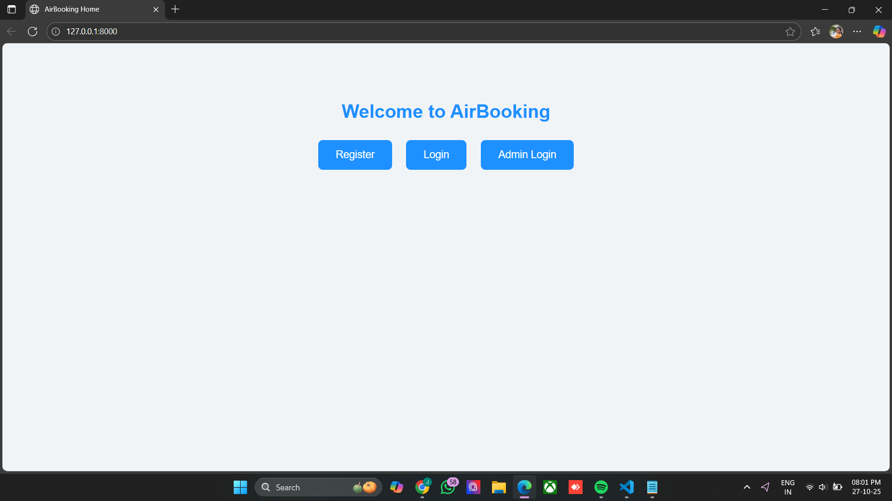
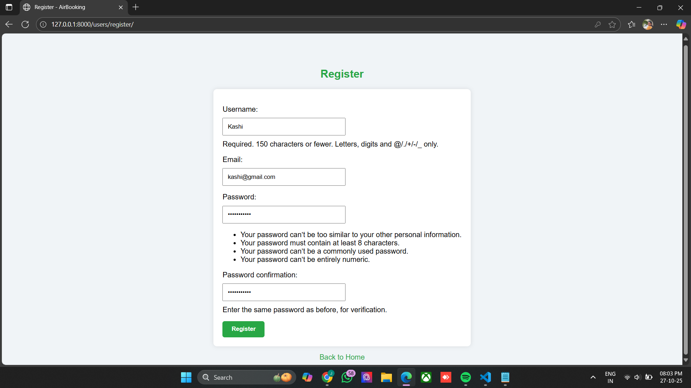
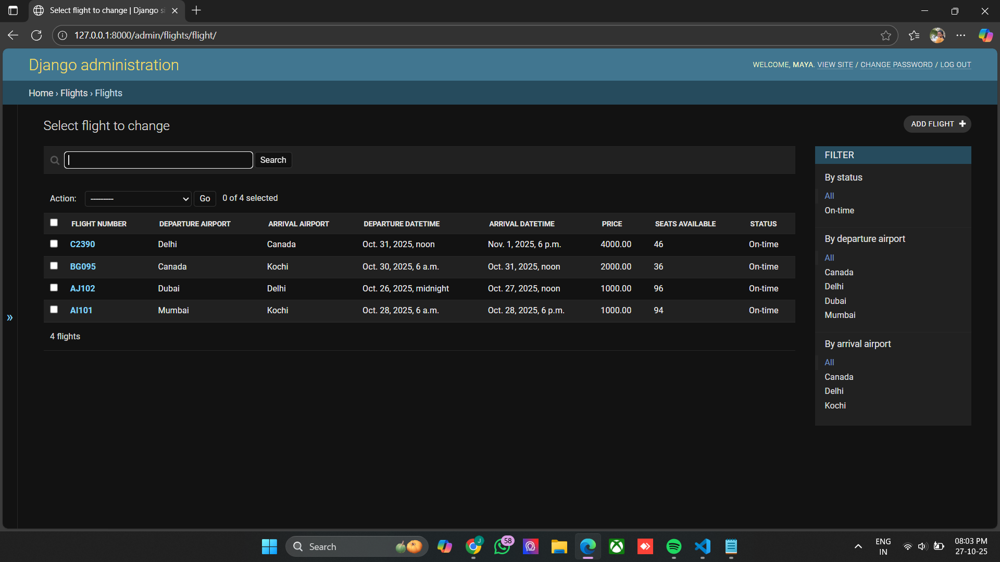
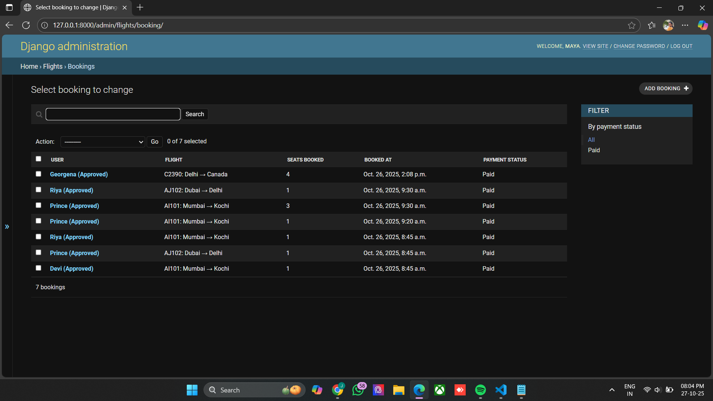

# AirBookingProject

## Project Overview
AirBookingProject is a full-stack flight booking application built with Django (backend) and React (frontend).  

**Key Features:**
- User registration with admin approval
- JWT login authentication
- Search and view available flights
- Admin can add/update flights and approve users
- Booking flights for registered users

## Admin Credentials for Testing

Use the following account to log in to the admin panel and test the application:

- **Username:** maya
- **Email:** maya123@gmail.com
- **Password:** airbooking2025

## 📸 Project Screenshots

Below are the screenshots of different sections of the AirBooking application.

---

### 🏠 Home Page

### 📝 User Registration

### 🔐 User Login

### ✈️ Search Flights

### 🧾 User Booking Page

### 🧳 User Trip Details

---

## 🧑‍💼 Admin Panel

### 🏡 Admin Home

### ✅ Admin Approval

### 📊 Admin Dashboard

### 🛫 Flights Management

### 👥 Users Management

### 📚 Bookings Management

